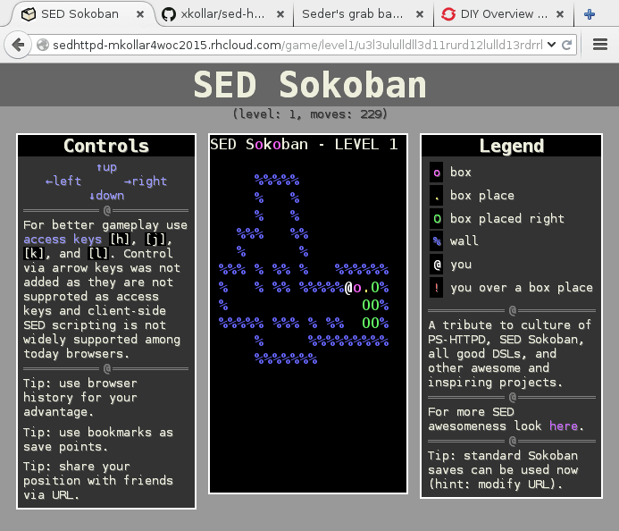

SED-HTTPD
=========

Unleash the power of [GNU sed](https://www.gnu.org/software/sed/)
and let it run your web server!

Features
--------

* It can contain everything in single file.
* It is easily integrated with OpenShift.
* It is secure.

[SedSocoban](http://aurelio.net/projects/sedsokoban/) included
for awesomeness points!

Standalone usage
----------------

Prerequisites:

* GNU sed: stream editor for filtering and transforming text
* xinetd: the extended Internet services daemon

Optional:

* erb: Ruby Templating

Following UNIX philosophy of "small programs that do one thing and do it well",
networking part is left to `xinetd`. Its requirements for configuration are
rather strict, so to make configuration easy template `xinetd.conf.erb`
was prepared. But do not worry if you do not want to polute your system with Ruby.
It should be pretty strightforward to use the template only as inspiration
and create final configuration by hand. Once you have prepared `xinetd.conf`,
you can just run `run.sh` and it should be working.

OpenShift integration
---------------------

In case you have OpenShif Online account (it is free), you can easily
get your own instance just by running

~~~~ .bash
rhc app create sedhttpd --no-git \
    diy \
    --from-code 'https://github.com/xkollar/sed-httpd.git'
~~~~

Other
-----

For more sed awesomeness visit
[http://sed.sourceforge.net/grabbag/scripts/](http://sed.sourceforge.net/grabbag/scripts/).

